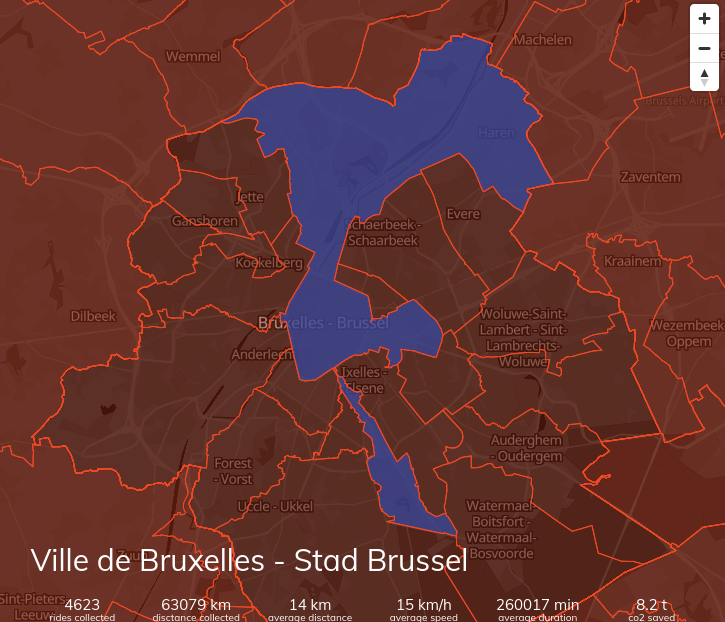

# Statistics Service  :bicyclist: :bicyclist: :bicyclist:

## About this repository

  

This repository contains code for the statistics service. A small service to generate basic statistics on the collected data. There are two services in this repo:

- BikeDataProject.Statistics.Service: Aggregrates data from the  main bike data project database onto boundaries taken from OSM.
- BikeDataProject.Statistics.Service.Tiles: Publish the aggregated data as Mapbox vector tiles.

These together generate the map on our website:

## Coding conventions

- During this project we will be using [C# Google Style guide](https://google.github.io/styleguide/csharp-style.html) + brackets on a newline.
- Prefer to use the Empty method on types to return empty variables.

## Code Structure

There are multiple (sub)projects in this repository:

- `BikeDataProject.Statistics` contains the definitions of the objects (and nothing more). It is referenced by the other projects
- `BikeDataProject.Statistics.Service` contains the service which calculates (track by track) the statistics of a given region
- `BikeDataProject.Statistics.Service` creates tiles from the boundaries
- The tools is used to load the country boundaries into the DB